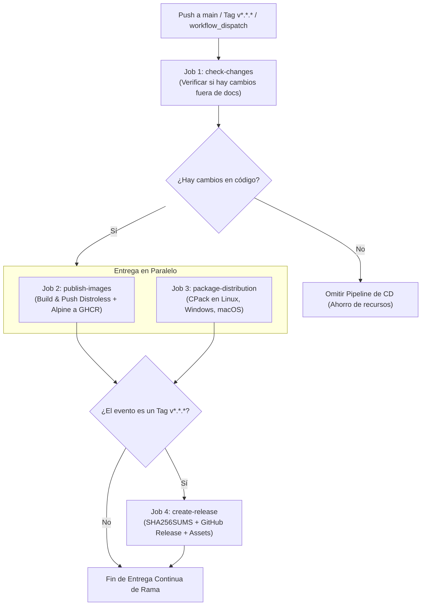

# CD Manager Skill — CrowKit 🦅

Esta Skill gobierna, ejecuta y audita los procesos de **Continuous Delivery & Deployment (CD)** en **CrowKit**, garantizando que los artefactos binarios, contenedores en GHCR y paquetes de distribución multiplataforma se publiquen con seguridad, trazabilidad criptográfica y versionado semántico estricto.

---

## 🎯 Alcance y Responsabilidades

1. **Gobernanza del Pipeline de Entrega (`cd.yml`):**
   - Supervisión y mantenimiento del workflow `.github/workflows/cd.yml`.
   - Control de disparadores de entrega: push a `main`/`master`, creación de tags de release (`v*.*.*`) y ejecución manual (`workflow_dispatch`).
2. **Publicación de Contenedores en GitHub Container Registry (GHCR):**
   - Construcción y subida multi-arquitectura de imágenes:
     - **Google Distroless:** Imagen minimalista endurecida (sin shell, no-root) para producción.
     - **Alpine Linux:** Imagen ligera con shell auxiliar para diagnósticos o depuración.
   - Tagging automático: `latest`, `distroless`, `alpine`, semver (`major.minor`, `patch`), y Git commit SHA corto.
3. **Empaquetado Multiplataforma con CPack:**
   - Generación y publicación de instaladores en matriz multiplataforma:
     - **Linux (Ubuntu Latest):** Paquetes `.deb` (Debian/Ubuntu), `.rpm` (RHEL/CentOS/Fedora) y `.tar.gz`.
     - **Windows (Windows Latest):** Paquetes comprimidos `.zip`.
     - **macOS (macOS Latest):** Archivos empaquetados `.tar.gz`.
4. **Generación de GitHub Releases y Checksums:**
   - Automatización de releases en GitHub con `softprops/action-gh-release@v2`.
   - Generación obligatoria del archivo de integridad criptográfica `SHA256SUMS.txt`.
   - Generación de notas de lanzamiento (Release Notes) basadas en commits semánticos.
5. **Delivery Gates y Optimización:**
   - Verificación previa de cambios en código (`check-changes`): Omite el pipeline de entrega si la inserción en `main` solo contiene modificaciones de documentación.

---

## 🚀 Flujo de Entrega Continua (CD Pipeline)



---

## 📦 Estrategia de Versionado y Tagging

El `cd-manager` supervisa que toda entrega formal siga el estándar **Semantic Versioning (SemVer 2.0.0)**:

### 1. Convención de Tags
- Formato: `v<MAJOR>.<MINOR>.<PATCH>` (ej. `v1.2.0`, `v1.2.1-rc.1`).
- Los tags deben ser anotados y firmados siempre que sea posible:
  ```bash
  git tag -a v1.2.0 -m "release(core): version 1.2.0 con soporte para microservicios Crow"
  git push origin v1.2.0
  ```

### 2. Matriz de Tags en GHCR (`ghcr.io/luisfdocelis/crowkit`)
- **Distroless:**
  - `ghcr.io/luisfdocelis/crowkit:latest` (apunta a la última versión en `main`)
  - `ghcr.io/luisfdocelis/crowkit:distroless`
  - `ghcr.io/luisfdocelis/crowkit:1.2.0`
  - `ghcr.io/luisfdocelis/crowkit:1.2`
  - `ghcr.io/luisfdocelis/crowkit:<sha-corto>`
- **Alpine:**
  - `ghcr.io/luisfdocelis/crowkit:alpine`
  - `ghcr.io/luisfdocelis/crowkit:1.2.0-alpine`
  - `ghcr.io/luisfdocelis/crowkit:<sha-corto>-alpine`

---

## 🛡️ Delivery Gates (Criterios de Aprobación de Release)

Antes de promover un corte de versión o autorizar la publicación de release:

- [ ] **Gate CD-1 (Código Certificado):** Los checks de CI en `development` y el PR a `main` están al 100% en verde.
- [ ] **Gate CD-2 (Imágenes Construibles):** `scripts/build-docker.sh --all` compila localmente sin errores de dependencias.
- [ ] **Gate CD-3 (Empaquetado CPack):** La compilación de herramientas CLI en `tools/` genera binarios funcionales listos para empaquetar.
- [ ] **Gate CD-4 (Integridad Criptográfica):** Todos los binarios a publicar deben contar con sus respectivos hashes SHA256 registrados en `SHA256SUMS.txt`.
- [ ] **Gate CD-5 (Permisos de Registro):** El secret `GITHUB_TOKEN` o las credenciales de GHCR cuentan con alcance `packages: write`.
