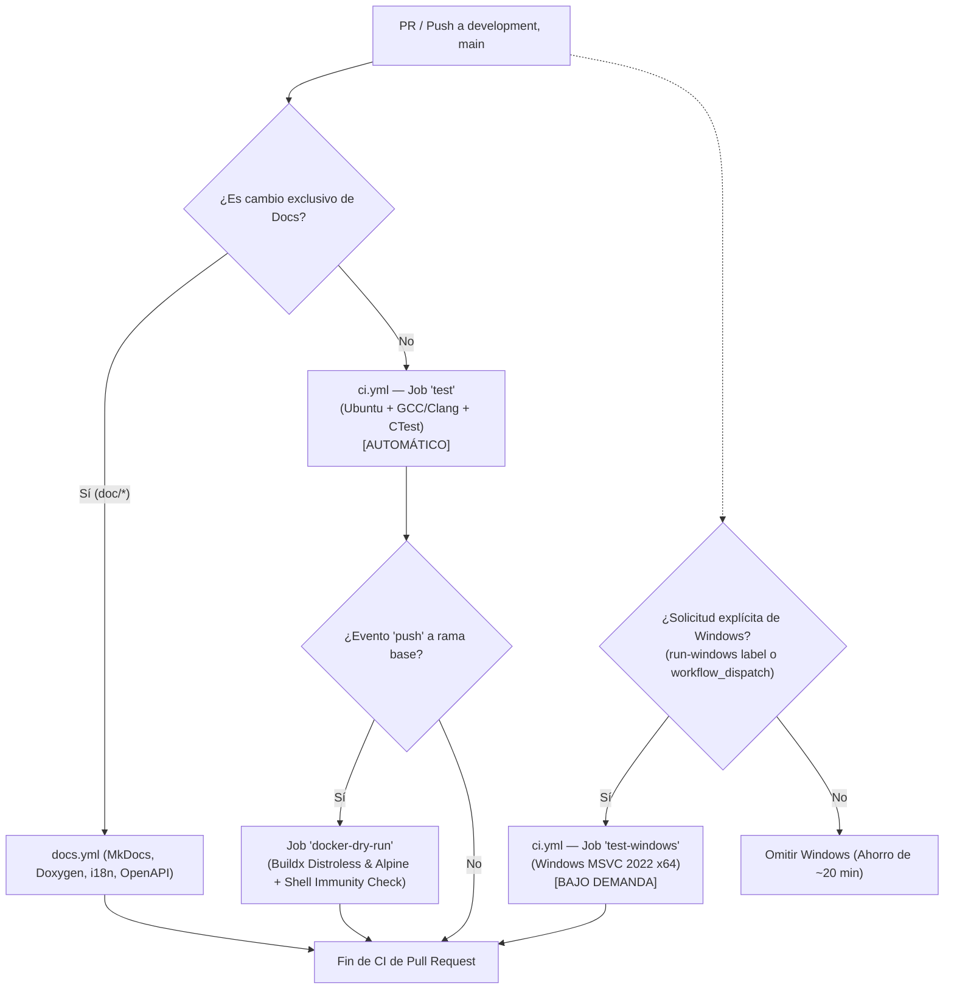

# CI Manager Skill — CrowKit 🦅

Esta Skill gobierna, optimiza y audita los flujos de **Continuous Integration (CI)** de **CrowKit**, garantizando compilaciones multi-plataforma deterministas, ejecución de pruebas CTest y validación anticipada de workflows tanto en GitHub Actions como de manera local mediante `act`.

---

## 🎯 Alcance y Responsabilidades

1. **Gobernanza de Workflows de CI:**
   - Supervisión y mantenimiento de `.github/workflows/ci.yml` y `.github/workflows/docs.yml`.
   - Control de disparadores (`pull_request`, `push`, `workflow_dispatch`) y políticas de concurrencia (`cancel-in-progress: true`).
2. **Matriz de Compilación Multiplataforma:**
   - **Linux (`test`):** Ubuntu Latest, GCC/Clang, CMake 3.20+, Ninja, C++20, y ejecución de 311 tests en CTest.
   - **Windows (`test-windows`):** Windows 2022, MSVC (Visual Studio 17 2022) x64, C++20, CTest Release y validación de empaquetado ZIP con CPack.
   - **Linux (`test`):** Ubuntu Latest, GCC/Clang, CMake 3.20+, Ninja, C++20, y ejecución de 311 tests en CTest (ejecución automática en todo PR/push).
   - **Windows (`test-windows`):** Windows 2022, MSVC (Visual Studio 17 2022) x64, C++20, CTest Release y validación de empaquetado ZIP con CPack. **Bajo Demanda:** Solo se ejecuta si se solicita explícitamente vía `workflow_dispatch` (`run_windows: true`) o con la etiqueta `run-windows` en el PR, ahorrando 15-25 minutos por corrida en PRs ordinarios.
3. **Estrategia de Caching y Aceleración:**
   - Gestión de `actions/cache@v4` para dependencias FetchContent en `build/_deps` y `build-windows/_deps`.
   - Reducción de tiempos de build mediante claves basadas en el hash de los archivos `**/CMakeLists.txt`.
4. **Validación Local con `act`:**
   - Emulación de GitHub Actions en local mediante Docker y `act` antes de realizar push remoto.
   - Emulación de GitHub Actions en local mediante Docker y `act` antes de realizar push remoto (`./.agents/scripts/test-workflow-act.sh`).
   - Los workflows invocan directamente los scripts del repositorio (`verify.sh`, `scripts/verify-*.sh`) garantizando paridad del 100% entre local y remoto.
5. **Monitoreo de Checks de PR:**
   - Seguimiento automatizado del estado de los checks con `gh pr checks --watch`.

---

## 🏗️ Estructura de Pipelines de CI en CrowKit



---

## 🛠️ Validación Local de CI con `act`

Para no consumir minutos de GitHub Actions ni esperar la nube ante errores sintácticos de YAML o fallos de compilación en runner, el `ci-manager` promueve la prueba local:

### 1. Validación de Sintaxis de Workflows (Dry-Run)
Verifica que la sintaxis HCL/YAML de los workflows sea válida sin levantar contenedores:
```bash
act pull_request -n
```

### 2. Ejecución Local del Job de Linux (`test`)
Ejecuta el job `test` dentro del entorno containerizado oficial de Ubuntu:
```bash
# En Linux / macOS
./.agents/scripts/test-workflow-act.sh --job test

# En Windows (PowerShell)
.\.agents\scripts\test-workflow-act.ps1 -Job test
```

> [!TIP]
> Si Docker no tiene configurado el socket por defecto, el script detecta automáticamente sockets alternativos como `$HOME/.docker/desktop/docker.sock` o sockets de usuario systemd (`/run/user/$UID/docker.sock`).

---

## 📋 Reglas de Optimización y Seguridad de CI

1. **Regla de Ahorro de Recursos (Paths Ignore y Filtro de Ramas):**
   - Las ramas que inicien con `doc/` o `docs/` deben omitir automáticamente los jobs de compilación C++ pesados (`ci.yml`) mediante la condición:
     `if: "!startsWith(github.head_ref, 'doc/') && !startsWith(github.head_ref, 'docs/')"`
   - Los cambios puramente documentales ejecutan exclusivamente `docs.yml` (~15 segundos vs ~8 minutos).
2. **Determinismo de Compilación:**
   - La configuración de CMake en CI debe compilar siempre con `-DCMAKE_BUILD_TYPE=Release`, `-DCROWKIT_BUILD_TESTS=ON` y `-DCROWKIT_BUILD_TEMPLATES=ON`.
3. **Validación de Inmunidad Shell en Docker Dry-Run:**
   - En el job `docker-dry-run`, se debe validar que el contenedor Google Distroless no contenga `/bin/sh`. Si el comando `docker run --rm --entrypoint sh crowkit:distroless-dryrun` responde con éxito, el pipeline **DEBE FALLAR** por violación de seguridad.
4. **Política ante Fallo de Checks:**
   - Si un check falla en GitHub Actions:
     1. Usar `gh pr checks` para identificar el job fallido.
     2. Inspeccionar el log exacto con `gh run view --log-failed`.
     3. Reproducir el fallo localmente con `verify.sh` o `act`.
     4. Aplicar la corrección antes de solicitar nuevamente revisión.
