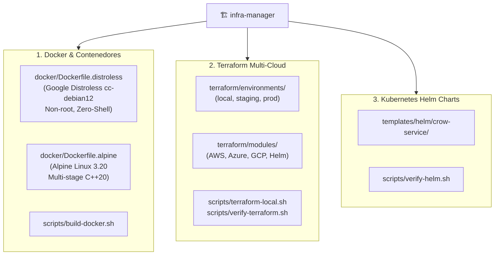

# Infrastructure Manager Skill — CrowKit 🦅

Esta Skill gobierna, aprovisiona y audita de manera unificada toda la **Infraestructura como Código (IaC)**, los **Contenedores Docker** y las **Plantillas de Kubernetes (Helm)** en **CrowKit**, cubriendo tanto el desarrollo local como los despliegues Multi-Cloud en AWS, GCP y Azure.

---

## 🏛️ Áreas de Responsabilidad



---

## 🐳 1. Gobernanza de Contenedores Docker

CrowKit provee dos opciones de contenedores optimizadas para microservicios C++20:

### 1.1 Imágenes Oficiales
- **Google Distroless (`docker/Dockerfile.distroless`):**
  - **Base:** `gcr.io/distroless/cc-debian12:nonroot`.
  - **Seguridad:** Usuario no-root (`USER 65534:65534`).
  - **Inmunidad Shell:** Cero shells (`/bin/sh`, `/bin/bash` ausentes). Reduce drásticamente la superficie de ataque y previene la ejecución remota de código (RCE).
  - **Uso:** Recomendado para entornos de Producción.
- **Alpine Linux (`docker/Dockerfile.alpine`):**
  - **Base:** `alpine:3.20`.
  - **Características:** Imagen ultraligera (~15-25 MB) con shell POSIX auxiliar para diagnósticos e inspección de red.
  - **Uso:** Recomendado para Staging, pruebas locales y depuración.

### 1.2 Comandos de Construcción Local
El script `scripts/build-docker.sh` estandariza el build de imágenes:
```bash
# Construir solo la imagen Google Distroless
./scripts/build-docker.sh --distroless

# Construir solo la imagen Alpine Linux
./scripts/build-docker.sh --alpine

# Construir ambas imágenes
./scripts/build-docker.sh --all
```

---

## ☁️ 2. Terraform Multi-Cloud (`terraform/`)

### 2.1 Estructura de Directorios
```text
terraform/
├── environments/
│   ├── local/                 # Entorno local (Docker Provider kreuzwerker/docker)
│   ├── staging/               # Staging en Cloud (AWS/GCP/Azure)
│   └── prod/                  # Producción de alta disponibilidad
└── modules/
    ├── aws/                   # Módulos AWS: ecr, eks, kms, vpc
    ├── azure/                 # Módulos Azure: acr, aks, key_vault, vnet
    ├── gcp/                   # Módulos GCP: artifact_registry, gke, secret_manager, vpc
    └── helm_crow_service/     # Módulo de integración Terraform-Helm
```

### 2.2 Entorno Local con Docker Provider
Para probar infraestructura local sin costo en la nube:
```bash
# En Linux / macOS
./scripts/terraform-local.sh init
./scripts/terraform-local.sh plan
./scripts/terraform-local.sh apply
./scripts/terraform-local.sh destroy

# En Windows (PowerShell)
.\scripts\terraform-local.ps1 -Action init
.\scripts\terraform-local.ps1 -Action plan
.\scripts\terraform-local.ps1 -Action apply
.\scripts\terraform-local.ps1 -Action destroy
```

### 2.3 Validación de Terraform
Verificar formato y sintaxis HCL en todos los entornos y módulos:
```bash
./scripts/verify-terraform.sh
```

---

## ☸️ 3. Plantillas Helm de Kubernetes

CrowKit incluye un Helm Chart modular para empaquetar y desplegar servicios Crow en clústeres Kubernetes (EKS, GKE, AKS o Minikube/K3s):

- **Ruta del Chart:** `templates/helm/crow-service/`
- **Componentes:**
  - `Deployment`: Con probes de liveness y readiness apuntando a `/health`.
  - `Service`: Exposición ClusterIP, NodePort o LoadBalancer.
  - `Ingress`: Soporte para NGINX o Traefik con TLS.
  - `ServiceAccount` y `HPA` (Horizontal Pod Autoscaler).
- **Validación de Helm:**
  ```bash
  ./scripts/verify-helm.sh
  ```
  Ejecuta `helm lint` sobre el chart y valida la renderización de manifiestos con `helm template`.

---

## 🛑 Protocolos de Seguridad Obligatorios

1. **Aislamiento de Estado (`.tfstate`):**
   - Los archivos de estado `*.tfstate`, `*.tfstate.*` y el directorio `.terraform/` tienen **PROHIBIDO** commitearse en Git (debidamente ignorados en `.gitignore`).
   - En staging/prod se debe configurar siempre un backend remoto seguro (ej. S3 con DynamoDB locking o GCS bucket con versionado y cifrado KMS).
2. **Gestión de Secretos:**
   - Prohibido hardcodear contraseñas, tokens JWT o claves de API en archivos `*.tf` o `values.yaml`.
   - Utilizar proveedores nativos de secretos: AWS KMS/Secrets Manager, GCP Secret Manager o Azure Key Vault (módulos incluidos en `terraform/modules/`).
3. **Validación Pre-Push:**
   - Ejecute las validaciones de Terraform y Helm configuradas por el proyecto. Si alguna falla, no publique los cambios.
