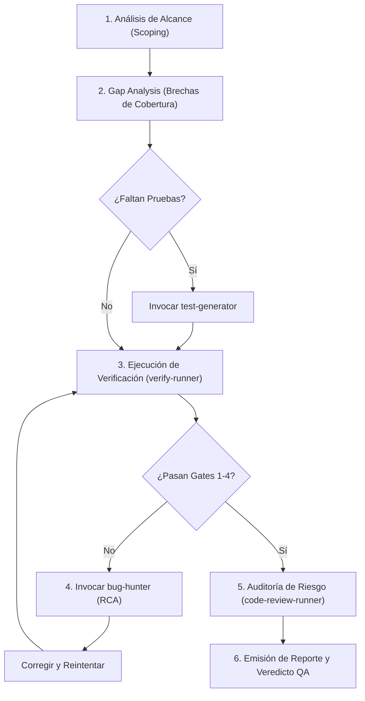

# QA Orchestrator Skill — CrowKit 🦅

Esta Skill actúa como el **Orquestador Central de Calidad (QA Lead & Gatekeeper)** para el proyecto **CrowKit**. Su responsabilidad es garantizar que ningún cambio de código, arquitectura o documentación se integre al repositorio sin haber superado la pirámide de pruebas y los **5 Quality Gates** institucionales.

---

## 🏛️ Matriz de Delegación y Subagentes Coordinados

El `qa-orchestrator` no ejecuta todas las tareas de forma monolítica; coordina y delega en subagentes especializados:

| Subagente Delegado | Skill / Ruta | Responsabilidad Delegada |
| :--- | :--- | :--- |
| **test-generator** | [skills/test-generator/SKILL.md](../test-generator/SKILL.md) | Creación de nuevas pruebas unitarias (GoogleTest), fixtures, mocks y casos borde en `libs/*/tests`. |
| **verify-runner** | [skills/verify-runner/SKILL.md](../verify-runner/SKILL.md) | Ejecución física de scripts de validación (`verify.sh --docs-only` o `verify.sh --full`). |
| **code-review-runner** | [skills/code-review-runner/SKILL.md](../code-review-runner/SKILL.md) | Auditoría estática de código, detección de regresiones, severidad de riesgos y cobertura de rutas críticas. |
| **bug-hunter** | [skills/bug-hunter/SKILL.md](../bug-hunter/SKILL.md) | Diagnóstico de causa raíz (RCA) cuando un test falla y diseño de la prueba de regresión previa al parche. |

---

## 🔺 Pirámide de Pruebas de CrowKit

El `qa-orchestrator` estructura la estrategia de calidad en cuatro capas progresivas:

```text
               / \
              /   \
             / E2E \           Capa 4: Contenedores, Distroless Shell Immunity y Pipelines
            /-------\
           / Contratos\        Capa 3: OpenAPI 3.1, Helm Lint, Terraform Validate, Docs/i18n
          /-------------\
         /  Integración  \     Capa 2: Endpoints Crow (app.handle_full sin sockets de red)
        /-----------------\
       /     Unitarias     \   Capa 1: GoogleTest en libs/*/tests (AAA, Mocks, Aislamiento)
      /---------------------\
```

1. **Capa 1 — Pruebas Unitarias (GoogleTest):**
   - Cobertura de lógica de negocio en `libs/` (`core`, `auth`, `db`, `config`, `audit`, `ioc`, `messaging`, `runtime`, `storage`).
   - Uso riguroso del patrón Arrange-Act-Assert (AAA).
   - Aislamiento mediante mocks de interfaces abstractas.
2. **Capa 2 — Pruebas de Integración Crow (Blueprints & Handlers):**
   - Validación de controladores y blueprints mediante `app.handle_full(req, res)`.
   - Verificación de serialización JSON (`crow::json`), códigos de estado HTTP y middlewares sin requerir apertura de puertos de red físicos.
3. **Capa 3 — Pruebas de Contratos, Sintaxis y Documentación:**
   - Validación OpenAPI 3.1 (`scripts/verify-openapi.sh`).
   - Linting de plantillas Helm (`scripts/verify-helm.sh`).
   - Formato y sintaxis de Terraform Multi-Cloud (`scripts/verify-terraform.sh`).
   - Compilación MkDocs Material y paridad i18n (`scripts/verify-i18n.sh`).
   - Doxygen C++20 sin errores (`scripts/verify-doxygen.sh`).
4. **Capa 4 — Validación de Entornos y Seguridad de Contenedores:**
   - Verificación de imagen Distroless (inmunidad a shell `/bin/sh` y usuario no-root).
   - Validación de imagen Alpine Linux.

---

## 🛡️ Los 5 Quality Gates Obligatorios

Antes de autorizar el merge de cualquier PR a `development` o `main`, se deben certificar los siguientes gates:

| Quality Gate | Criterio de Aprobación | Script / Herramienta |
| :--- | :--- | :--- |
| **Gate 1: Build & Compiler Hygiene** | Compilación C++20 Release limpia con CMake sin warnings severos (`-Wall -Wextra`). | `cmake --build build` |
| **Gate 2: Unit & Integration Suite** | 100% de las suites CTest aprobadas (311 tests existentes) sin excepciones no controladas. | `ctest --test-dir build --output-on-failure` |
| **Gate 3: Contract & IaC Compliance** | Especificaciones OpenAPI 3.1 válidas, Helm lint exitoso y Terraform HCL formateado. | `scripts/verify-*.sh` |
| **Gate 4: Documentation & i18n** | MkDocs compila sin errores, paridad multilingüe verificada y Doxygen generado. | `verify.sh --docs-only` |
| **Gate 5: Security & Regression Audit** | Cero hallazgos de severidad Alta en code review, blast radius controlado y memory safety. | `code-review-runner` |

---

## 🔄 Flujo de Orquestación de QA (Paso a Paso)

Cuando se active el `qa-orchestrator`, debe seguirse el siguiente procedimiento:



### Paso 1: Análisis de Alcance (Test Scoping)
- Determinar si el diff actual involucra exclusivamente documentación (`--docs-only`), librerías internas (`libs/`), herramientas (`tools/`), infraestructura (`terraform/`, `templates/helm/`) o pipelines (`.github/`).
- Seleccionar el perfil de verificación idóneo para optimizar tiempos.

### Paso 2: Análisis de Brechas (Gap Analysis)
- Comparar los archivos modificados contra las suites de pruebas existentes.
- Si una nueva función, endpoint o clase no tiene pruebas asociadas:
  - Invocar a **`test-generator`** para redactar los casos de prueba correspondientes.

### Paso 3: Ejecución de Verificación y Pruebas con `act`
- **En Desarrollo Activo (TDD / Iteración Rápida):**
  - Para retroalimentación en segundos, se pueden ejecutar pruebas unitarias nativas directas con CTest (`ctest -R <nombre_test>`) o la suite `./.agents/scripts/verify.sh`.
- **En Quality Gate Oficial Pre-Push / Pre-PR:**
  - **Las pruebas se ejecutan obligatoriamente mediante `act` en lugar de llamar solo a los scripts sueltos:**
    ```bash
    ./.agents/scripts/test-workflow-act.sh --job test
    ```
  - `act` emula GitHub Actions ejecutando el workflow `.github/workflows/ci.yml`, el cual se encarga de invocar y coordinar los scripts del repositorio (`verify.sh`, CMake y CTest).
  - Si el cambio es exclusivamente documental, se ejecuta `./.agents/scripts/verify.sh --docs-only` (~10-15 segundos).

### Paso 4: Triaje de Fallos y RCA (si aplica)
- Si cualquier prueba de CTest o script de validación falla:
  - Detener inmediatamente el flujo.
  - Invocar a **`bug-hunter`** para realizar Root Cause Analysis (RCA).
  - Exigir una prueba de regresión que reproduzca la falla antes de aplicar el parche.

### Paso 5: Auditoría de Calidad y Riesgo
- Invocar a **`code-review-runner`** para auditar:
  - Memory safety (RAII, smart pointers, prevención de memory leaks).
  - Manejo de excepciones y códigos de retorno HTTP seguros.
  - Detección de cuellos de botella de concurrencia o bloqueos en hilos de Crow.

### Paso 6: Emisión del Reporte y Veredicto de QA
- Generar un reporte formal de calidad con el veredicto final.

---

## 📋 Plantilla Oficial: Reporte de Veredicto de QA

```markdown
# 🦅 Reporte de Auditoría y Quality Gates — CrowKit

- **Rama Evaluada:** `[feat/fix/doc/... - nombre]`
- **Commit / SHA:** `[hash]`
- **Fecha:** `[AAAA-MM-DD]`
- **Veredicto General:** `[ ✅ PASS | ❌ FAIL | ⚠️ BLOCKED ]`

## 1. Estado de los Quality Gates

| Gate | Descripción | Estado | Observaciones |
| :--- | :--- | :--- | :--- |
| **Gate 1** | Compilación C++20 Release | `[ PASS / FAIL ]` | [Detalle de warnings o build] |
| **Gate 2** | Suite CTest (311 tests) | `[ PASS / FAIL ]` | [Total tests ejecutados y aprobados] |
| **Gate 3** | Contratos OpenAPI / Helm / TF | `[ PASS / FAIL / N/A ]` | [Resultado de validaciones de contratos] |
| **Gate 4** | Documentación e i18n | `[ PASS / FAIL ]` | [Paridad de idiomas y MkDocs] |
| **Gate 5** | Auditoría de Regresión y Seguridad | `[ PASS / FAIL ]` | [Severidad de hallazgos detectados] |

## 2. Brechas de Cobertura y Pruebas Añadidas
- **Archivos con Nuevas Pruebas:** `[libs/.../test_*.cpp]`
- **Casos Borde Validados:** `[Detallar edge cases cubiertos]`

## 3. Riesgos Residuales
- `[Riesgo 1 / Ninguno]`

## 4. Recomendación Final
- `[APROBADO PARA MERGE / REQUIERE CORRECCIONES PREVIAS]`
```
